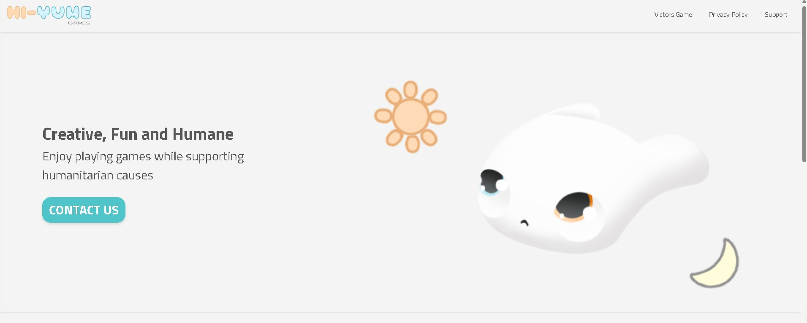
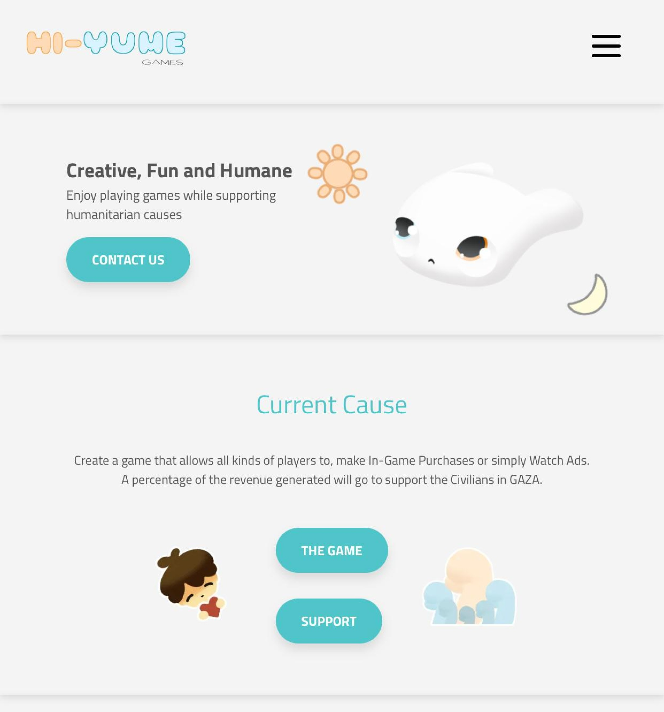

# Hi-Yume games Website 🎮

Hi-Yume is a game studio created by 4 siblings, their main goal is to make games that are fun and provide humanitarian showcase and aid to those in need.

## 🚀 Tech Stack
- **Frontend:** React, Next.js and TypeScript.
- **Backend:** Node.js for the backend and Vercel for hosting and deployment.
- **Styling:** Tailwind CSS for styling and custom CSS modules.
- **Forms** Created a custom forms component that connects to Google forms.

## ✨ Features
- A game studio website featuring my published game.
- Showcase of the team, roles and cause.
- Newsletter section to stay updated with latest news and updates.

## 🧑‍💻 Technical
- Custom made carousel for phone view.
- Custom made form connected to google forms.

## 📸 Homepage

## 🎥 Video showcase of the project
[▶️ Watch on YouTube](https://www.youtube.com/shorts/GH8TfUCwB8g)

## 🔗 Check the live website
👉 [Hi-Yume games Website](https://www.hiyume.games)